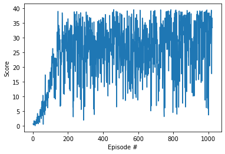

[//]: # (Image References)

[image1]: https://user-images.githubusercontent.com/10624937/43851024-320ba930-9aff-11e8-8493-ee547c6af349.gif "Trained Agent"

### 0. Introduction

This project is to create an agent within Unity's Reacher environment to control a double-jointed arm such that it would track a ball around: A reward of +0.1 is provided for each step that the agent's hand is in the goal location. Thus, the goal of your agent is to maintain its position at the target location for as many time steps as possible.

In order to solve the environment, our agent must achieve an average score of +30 over 100 consecutive episodes.

The observation space consists of 33 variables corresponding to position, rotation, velocity, and angular velocities of the arm. Each action is a vector with four numbers, corresponding to torque applicable to two joints. Every entry in the action vector should be a number between -1 and 1.

This report contains the introduction of the algorithm, and the network architecture. Also we included the training hyperparameters being used and result we achieved.

![Trained Agent][image1]

### 1. Learning Algorithm

Reinforcement learning algorithms can be categoized as either value-based, policy-based or combination of the two. Value-based learning consists of learning a state-action value function (Value/Q-function) that leads to the highest-valued state, by contract the policy-based approach tries to directly learn a (optimal) policy function directly (without the intermediary Value/Q-function).

Within the category of value-based methods, there is an existing algorithm called DQN, which is training a deep neural network to provide a staste-action value function, and has been proven to be effective under the scenario of discrete action space. However, in this environment, we need to make actions in continuous action space. Thus, we will use the Deep Deterministic Policy Gradient (DDPG) algorithm instead. This algorithm builds on DPG but introduces an actor-critic architecture to deal with continuous action space.

 - DDPG is a policy gradient algorithm that uses a stochastic behavior policy for good exploration but estimates a deterministic target policy, which is much easier to learn. Policy gradient algorithms utilize a form of policy iteration: they evaluate the policy, and then follow the policy gradient to maximize performance. Since DDPG is off-policy and uses a deterministic target policy, this allows for the use of the Deterministic Policy Gradient theorem (which will be derived shortly). DDPG is an actor-critic algorithm as well; it primarily uses two neural networks, one for the actor and one for the critic. These networks compute action predictions for the current state and generate a temporal-difference (TD) error signal each time step. The input of the actor network is the current state, and the output is a single real value representing an action chosen from a continuous action space (whoa!). The critic’s output is simply the estimated Q-value of the current state and of the action given by the actor. The deterministic policy gradient theorem provides the update rule for the weights of the actor network. The critic network is updated from the gradients obtained from the TD error signal.
 
The Actor-Critic learning algorithm is used to represent the policy function independently of the value function. The policy function structure is known as the actor, and the value function structure is referred to as the critic. The actor produces an action given the current state of the environment, and the critic produces a TD (Temporal-Difference) error signal given the state and resultant reward. If the critic is estimating the action-value function Q(s,a), it will also need the output of the actor. The output of the critic drives learning in both the actor and the critic. In Deep Reinforcement Learning, neural networks can be used to represent the actor and critic structures.

### 2. Network Architecture

The network architecture design started from the DDPG sample from the Deep Reinforcement Learning Nano-Degree repo. We kept the same basic network architecture in terms of number of layers and number of units: 2 fully connected hidden layers with ReLu activations for both the actor and the critic networks. Two hidden layers were using 128 units respectively. TWe added a batch normalization after the first hidden layer for the actor network to speed up the training. We also added the same batch normalization layer in the critic network. The smoothing/regularizing effect of batch normalization was proven with the score performance in the early stage of the training process.

### 3. Hyper-parameters

We used the following hyperparameters in the training process:

```
BUFFER_SIZE = int(1e5)  # replay buffer size
BATCH_SIZE = 128        # minibatch size
GAMMA = 0.99            # discount factor
TAU = 1e-3              # for soft update of target parameters
LR_ACTOR = 2e-4         # learning rate of the actor 
LR_CRITIC = 2e-4        # learning rate of the critic
WEIGHT_DECAY = 0        # L2 weight decay

```

### 4. Training Scores
The agent was able to solve the environment by achieving score of 30.0 over 100 consecutive episodes after 1023 episodes.


### 5. Training Output

```
Episode 100	Average Score: 5.59
Episode 200	Average Score: 23.48
Episode 300	Average Score: 26.13
Episode 400	Average Score: 26.28
Episode 500	Average Score: 28.15
Episode 600	Average Score: 24.98
Episode 700	Average Score: 26.39
Episode 800	Average Score: 27.78
Episode 900	Average Score: 28.27
Episode 1000	Average Score: 28.86
Episode 1023	Average Score: 30.01
Environment solved in 1023 episodes!	Average Score: 30.01
```

### 6. Future Improvements
The amount of experimentation that could be performed was somewhat limited by the amount of time is required to perform training; so an obvious first point is further experimentation on the network architecture to find a more optimum actor and critic architecture. Some other thoughts include:

 - Introduce a decay to the noise added to the action to improve stability.
 - Use a priority algorithm for sampling from the replay buffer instead of uniformly sampling
 - Use recurrent networks to capture temporal details of the environment.
